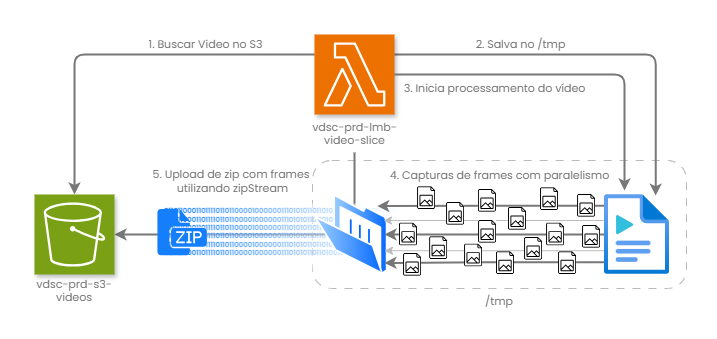
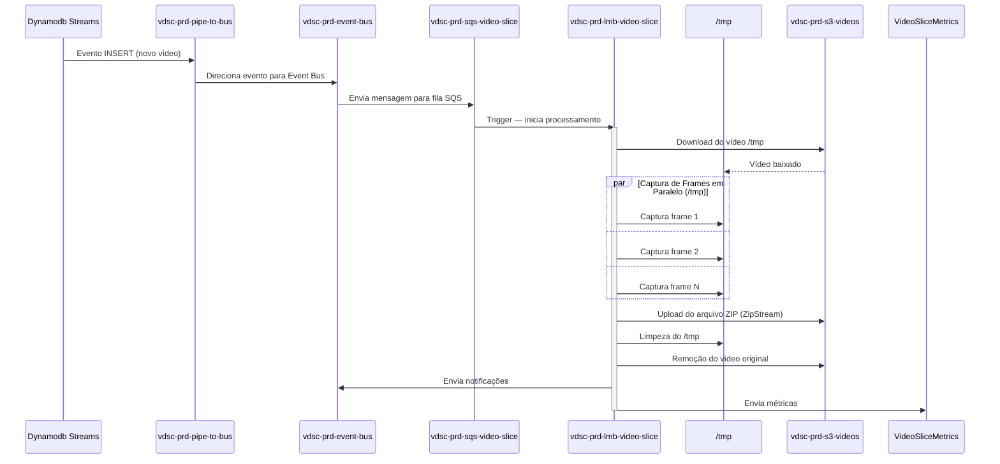
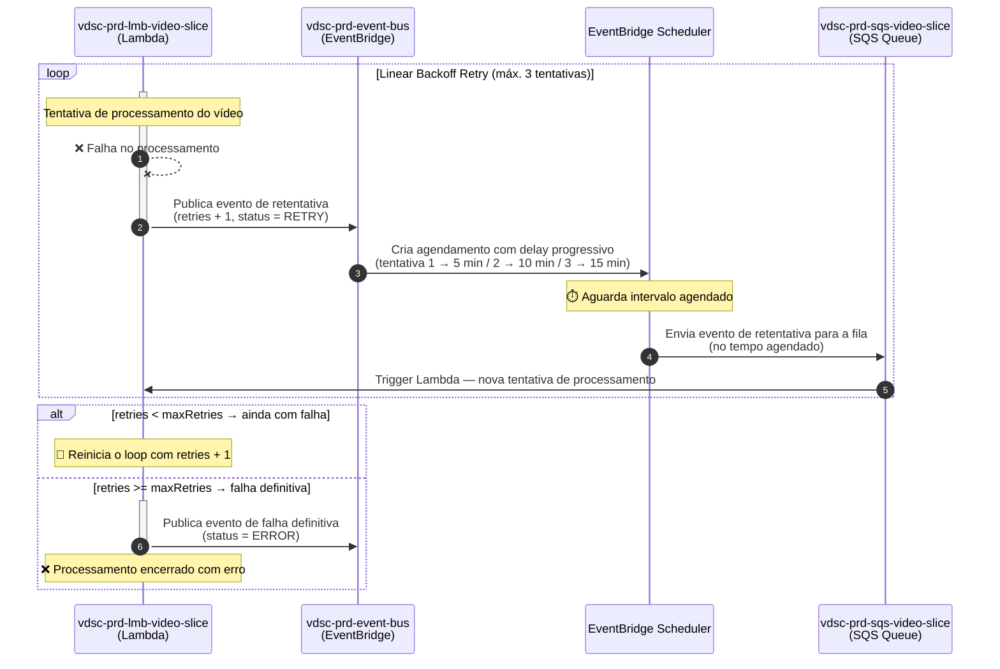

# MS Video Slice

[](https://github.com/11soat-hackathon-videoslice/ms-video-slice/actions/workflows/build_test_deploy_lambda.yaml)
[](https://sonarcloud.io/summary/new_code?id=11soat-hackton-videoslice_ms-video-slice)

Microserviço AWS Lambda para processamento e captura de frames de vídeos.

## 📋 Visão Geral

O **ms-video-slice** é o motor de processamento do sistema VideoSlice, implementado como AWS Lambda Function. 

## 🏗️ Arquitetura

O microserviço segue os princípios da **Clean Architecture**, utilizando a biblioteca core [video-slice-core](https://github.com/11soat-hackathon-videoslice/video-slice-core) para implementação das camadas de domínio e aplicação.

### Funcionalidades

- **Processamento de Vídeos**: Download, transformação e upload de vídeos
- **Captura Temporal**: Corte de vídeos em intervalos específicos ou recorrentes.
- **Redimensionamento**: Ajuste de resolução (Ultra, Alta, Média, Baixa)
- **Compressão**: Otimização de qualidade e tamanho
- **Retry Automático**: Sistema de reprocessamento em caso de falha utilizando _Linear Backoff Retry_
- **Integração com Core**: Utiliza a biblioteca video-slice-core para lógica de negócio
- **Métricas CloudWatch**: Monitoramento via AWS Lambda Powertools

### Diagramas de Sequência

### Detalhamento do processo principal - Captura de frames de vídeos
Quando falamos de arquitetura _Serveless_ temos a vantagem de não precisar se preocupar com a infraestrutura, mas temos que ter muita atenção com a otimização de recursos e tempo de execução para não disparar os custos.
Por conta disso, o processo de captura de frames é projetado para otimizar os recursos e tempo de processamento. Abaixo detalho as abordagens utilizadas:
- **Utilização do /tmp**: O diretório `/tmp` é utilizado para armazenar temporariamente os vídeos baixados e os frames capturados, garantindo que o processo seja eficiente e não dependa de armazenamento externo durante a execução
- **Captura de Frames em Paralelo**: Utilização de processamento paralelo para captura de frames, reduzindo significativamente o tempo total de processamento.
- **Separação de Captura e Persistência**: É fundamental separar a captura de frames da persistência dos arquivos, não gerando eventos bloqueadores e diminuindo a eficiência do paralelismo
- **Compressão com ZipStream**: A biblioteca ZipStream é utilizada para criar arquivos ZIP de forma eficiente, sem a necessidade de armazenar todos os frames na memória, o que é crucial para vídeos longos ou com muitos frames.

Abaixo um diagrama detalhando o processo de captura de frames:



#### Reprocessamento em Caso de Falha - _Linear Backoff Retry_
Sabemos que o processamento de vídeo pode ser suscetível a falhas, seja por limitações de recursos, erros temporários ou outros fatores. 
Para garantir a resiliência do sistema, implementamos um mecanismo de retry automático utilizando a estratégia de _Linear Backoff Retry_.
De forma parametrizável é possível configurar o número máximo de tentativas e o intervalo progressivo entre elas.
Exemplo, configuro máximo de 3 tentativas com fator de 5 minutos: primeira tentativa em 5 minutos, segunda em 10 minutos, terceira em 15 minutos.



## 🚀 Tecnologias

- **Python 3.12**: Linguagem de programação
- **AWS Lambda**: Plataforma serverless
- **AWS SQS**: Fila de mensagens
- **AWS S3**: Armazenamento de vídeos
- **AWS DynamoDB**: Banco de dados NoSQL
- **AWS EventBridge**: Barramento de eventos
- **OpenCV**: Processamento de vídeo
- **Pillow**: Manipulação de imagens
- **Boto3**: SDK AWS para Python
- **AWS Lambda Powertools**: Métricas e logs estruturados
- **video-slice-core**: Biblioteca core com domínio e casos de uso

## 📦 Dependências

### Dependências de Produção
- `boto3`: SDK AWS para Python
- `opencv-python-headless==4.10.0.84`: Processamento de vídeo
- `Pillow>=12.1.1`: Manipulação de imagens
- `numpy==1.26.4`: Operações numéricas
- `cryptography>=46.0.5`: Criptografia
- `zipstream-ng`: Compressão de arquivos
- `aws_lambda_powertools==3.24.0`: Métricas e logs
- `vdsc-core`: Biblioteca core com lógica de negócio

### Dependências de Desenvolvimento
- `pytest`: Framework de testes
- `pytest-cov`: Cobertura de testes
- `pytest-mock`: Mock para testes
- `pytest-asyncio`: Suporte a testes assíncronos
- `moto`: Mock de serviços AWS

## 🔧 Configuração

### Variáveis de Ambiente

A Lambda Function requer as seguintes variáveis de ambiente:

| Variável | Descrição | Exemplo |
|----------|-----------|---------|
| `AWS_REGION` | Região AWS (configurada automaticamente) | `us-east-1` |
| `S3_BUCKET_NAME` | Nome do bucket S3 | `vdsc-prd-s3-videos` |
| `S3_BUCKET_DIR_UPLOADS` | Diretório de uploads | `uploads/` |
| `S3_BUCKET_DIR_FINISHED` | Diretório de vídeos processados | `finished/` |
| `DYNAMODB_TABLE_NAME` | Nome da tabela DynamoDB | `VideoSlice` |
| `EVENTBRIDGE_BUS_NAME` | Nome do barramento EventBridge | `vdsc-prd-eventbridge` |
| `POWERTOOLS_SERVICE_NAME` | Nome do serviço para métricas | `video-slice` |
| `POWERTOOLS_METRICS_NAMESPACE` | Namespace de métricas | `VideoSlice` |

**Nota**: As variáveis `AWS_REGION` e `PYTHON_VERSION` são configuradas automaticamente pela AWS e não devem ser incluídas na configuração da Lambda.

## 📨 Estrutura de Mensagens

### Evento SQS de Entrada (INSERT)

```json
{
  "Records": [
    {
      "messageId": "b22abd8b-bc65-49ac-ac27-35cb0c8f4e25",
      "body": "{\"detail\":{\"eventName\":\"INSERT\",\"dynamodb\":{\"NewImage\":{\"videoId\":{\"S\":\"ml9jexx5TWrC\"},\"userId\":{\"S\":\"848834a8-20e1-7004-ee3b-4ba1495239d8\"},\"fileName\":{\"S\":\"2024-07-25_16-48-11\"},\"fileExtension\":{\"S\":\"mp4\"},\"status\":{\"S\":\"UPLOADED\"},\"startTime\":{\"N\":\"0\"},\"endTime\":{\"N\":\"31000\"},\"intervalTime\":{\"L\":[{\"S\":\"15000\"}]},\"unitTime\":{\"S\":\"ms\"},\"resize\":{\"S\":\"high\"},\"qualityOutputLevel\":{\"N\":\"100\"},\"maxRetries\":{\"N\":\"3\"},\"retries\":{\"N\":\"0\"},\"created\":{\"S\":\"2026-02-05T11:14:16Z\"}}}}}",
      "eventSource": "aws:sqs",
      "eventSourceARN": "arn:aws:sqs:us-east-1:080145351546:vdsc-prd-sqs-video-slice"
    }
  ]
}
```

### Estrutura do Item DynamoDB

```json
{
  "videoId": "ml9jexx5TWrC",
  "userId": "848834a8-20e1-7004-ee3b-4ba1495239d8",
  "fileName": "2024-07-25_16-48-11",
  "fileExtension": "mp4",
  "status": "UPLOADED",
  "startTime": 0,
  "endTime": 31000,
  "intervalTime": ["15000"],
  "unitTime": "ms",
  "resize": "high",
  "qualityOutputLevel": 100,
  "maxRetries": 3,
  "retries": 0,
  "created": "2026-02-05T11:14:16Z"
}
```

### Resposta de Sucesso (202)
```json
{
  "statusCode": 202,
  "body": "{\"status\": \"Recebido 1 evento(s) para processamento.\"}"
}
```

### Resposta de Erro (500)
```json
{
  "statusCode": 500,
  "body": "{\"error\": \"Erro ao processar vídeo ID: ml9jexx5TWrC - [detalhes do erro]\"}"
}
```

## 🎬 Opções de Processamento

### Níveis de Redimensionamento

| Nível | Resolução | Descrição |
|-------|-----------|-----------|
| `low` | 480p | Baixa qualidade, menor tamanho |
| `medium` | 720p | Qualidade média, tamanho moderado |
| `high` | 1080p | Alta qualidade, maior tamanho |

### Unidades de Tempo

| Unidade | Descrição |
|---------|-----------|
| `ms` | Milissegundos |
| `s` | Segundos |

### Qualidade de Saída

- **qualityOutputLevel**: 0-100 (recomendado: 80-100)

## 🧪 Testes

### Executar Testes Unitários

```bash
cd "C:\Users\A0157633\dev\java\f5\ms-video-slice"
pytest tests/unit/ --cov=src/core --cov-report=xml:coverage.xml --cov-report=html --cov-report=term --junitxml=test-results.xml -v --cov-fail-under=80
```

**Nota**: Os arquivos de configuração `pytest.ini` e `conftest.py` estão localizados dentro do diretório `tests/`.

### Validação Completa

Para validar o projeto (testes + quality gate):

```bash
cd "C:\Users\A0157633\dev\java\f5\ms-video-slice"
pytest tests/unit/ --cov=src/core --cov-report=xml:coverage.xml --cov-report=html --cov-report=term --junitxml=test-results.xml -v --cov-fail-under=80 && pysonar --sonar-token=<seu-token>
```

### Cobertura de Testes

O projeto mantém cobertura mínima de **80%** dos testes unitários, validada automaticamente na pipeline de CI/CD.

### Análise de Qualidade

```bash
pysonar --sonar-token=<seu-token>
```

A análise de qualidade é realizada automaticamente pelo SonarCloud a cada push/PR.

## 🚀 Deploy

### Pipeline CI/CD

O deploy é automatizado através do GitHub Actions. A pipeline executa:

1. **Testes Unitários**: Execução de todos os testes com cobertura mínima de 80%
2. **Quality Gate**: Validação de qualidade de código no SonarCloud
3. **Build**: Empacotamento da Lambda Function com dependências
4. **Deploy**: Deploy automático na AWS Lambda

### Deploy Manual

Para executar deploy manual:

```bash
# Via GitHub Actions
# 1. Acesse a aba "Actions" no repositório
# 2. Selecione "Build, Test and Deploy vdsc-prd-lmb-video-slice"
# 3. Clique em "Run workflow"
# 4. Configure "deploy_only" como true para pular os testes
```

### Logs

Os logs da Lambda Function estão disponíveis no CloudWatch Logs:
- Grupo: `/aws/lambda/vdsc-prd-lmb-video-slice`
- Região: `us-east-1`


## 🔗 Integração

### Trigger
- **SQS Queue**: `vdsc-prd-sqs-video-slice`
- **Batch Size**: Configurável (padrão: 1)
- **Visibility Timeout**: 900 segundos (15 minutos)
- **Reserved Concurrency**: Configurável para evitar throttling

### Recursos Relacionados
- **DynamoDB**: Tabela `VideoSlice` com Stream habilitado
- **EventBridge Pipes**: Roteamento de eventos DynamoDB → SQS
- **S3**: Buckets de upload e vídeos processados
- **EventBridge**: Publicação de eventos de notificação
- **CloudWatch Logs**: Armazena logs de execução
- **CloudWatch Metrics**: Métricas customizadas via Powertools

## 🔐 Permissões IAM

A Lambda Function requer as seguintes permissões:

- `sqs:ReceiveMessage`
- `sqs:DeleteMessage`
- `sqs:GetQueueAttributes`
- `s3:GetObject`
- `s3:PutObject`
- `s3:DeleteObject`
- `dynamodb:GetItem`
- `dynamodb:UpdateItem`
- `dynamodb:PutItem`
- `events:PutEvents`
- `logs:CreateLogGroup`
- `logs:CreateLogStream`
- `logs:PutLogEvents`
- `cloudwatch:PutMetricData`

## ⚙️ Configuração de Lambda

### Recomendações

- **Memória**: 3008 MB (recomendado para processamento de vídeo)
- **Timeout**: 900 segundos (15 minutos - máximo do Lambda)
- **Ephemeral Storage**: 10 GB (para armazenar vídeos temporariamente)
- **Architecture**: x86_64

### Sistema de Retry

- **maxRetries**: 3 (configurável no item DynamoDB)
- **Retry Automático**: Em caso de falha, o item é reprocessado
- **Dead Letter Queue**: Mensagens com falha persistente são movidas para DLQ

## 📊 Status de Processamento

O sistema gerencia os seguintes status:

| Status | Descrição |
|--------|-----------|
| `UPLOADED` | Vídeo enviado, aguardando processamento |
| `PROCESSING` | Vídeo em processamento |
| `FINISHED` | Processamento concluído com sucesso |
| `ERROR` | Erro no processamento |
| `RETRY` | Aguardando reprocessamento |

## 🔄 Fluxo de Reprocessamento

1. Lambda detecta erro no processamento
2. Contador de `retries` é incrementado
3. Se `retries < maxRetries`, status muda para `RETRY`
4. Evento é republicado para SQS
5. Lambda processa novamente
6. Se `retries >= maxRetries`, status muda para `ERROR` permanentemente

**Versão**: 1.0.0  
**Região AWS**: us-east-1  
**Runtime**: Python 3.12
